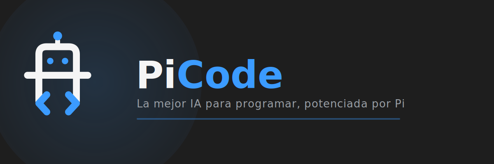

<div align="center">



<br />

[](./LICENSE)
[](#getting-a-runnable-tree)
[](https://github.com/VSCodium/vscodium)
[](https://pi.dev)
[](https://github.com/Gentleman-Programming/gentle-ai)
[](https://github.com/TomasPlatero/PiCode/actions/workflows/pin-check.yml)
[](https://github.com/TomasPlatero/PiCode/actions/workflows/full-build.yml)

</div>

<br />

> A curated VSCodium distribution with the **[Pi](https://pi.dev) coding agent** and **[Gentle
> AI](https://github.com/Gentleman-Programming/gentle-ai)** built in as first-class surfaces:
> the chat panel, the settings, the providers, the themes and the first-run wizard are part
> of the editor, not something you install after it.

PiCode is not a plugin for VS Code. It is a distribution: a stock VSCodium tree, branded and
patched, plus one extension that owns the agent layer. Opening PiCode means opening a
working agentic environment — no setup ceremony.

PiCode itself is **free and complete**: no feature is held back, and nothing it does needs a
server to work.

<br />

## Built on

PiCode doesn't reinvent the editor, the agent or the memory layer — it unifies three
open-source projects that already do their part well, and wires them together as one
coherent tool.

| | Project | What it brings to PiCode |
| --- | --- | --- |
|  | **[VSCodium](https://github.com/VSCodium/vscodium)** / [VS Code — MIT source](https://github.com/microsoft/vscode) | The editor itself: the base every surface in PiCode is built on. |
|  | **[Pi](https://pi.dev)** ([`earendil-works/pi`](https://github.com/earendil-works/pi), by Mario Zechner) | The coding agent: chat, tools, providers, models, packages and skills. |
|  | **[Gentle AI](https://github.com/Gentleman-Programming/gentle-ai)** & **[Engram](https://github.com/Gentleman-Programming/engram)** (Gentleman Programming) | Persistent memory, Spec-Driven Development workflow and curated skills on top of Pi. |

All three are MIT-licensed. Full attribution and upstream licenses are preserved and
documented in [`docs/DISTRIBUTION.md`](docs/DISTRIBUTION.md) — see [License](#license) below.

<br />

## Contents

- [What is in this repository, and what is not](#what-is-in-this-repository-and-what-is-not)
- [Getting a runnable tree](#getting-a-runnable-tree)
- [Building the core from source](#to-build-the-core-from-source)
- [Continuous integration](#continuous-integration)
- [Working on the agent layer](#working-on-the-agent-layer)
- [What exists today](#what-exists-today)
- [Known state](#known-state)
- [Where the reasoning lives](#where-the-reasoning-lives)
- [License](#license)

<br />

## What is in this repository, and what is not

The repository root doubles as the distribution root, because that is what enables portable
mode (a `data/` folder next to the executable). **The ~1 GB VSCodium payload is not
versioned**, and it cannot be: GitHub refuses any push carrying a file over 100 MB, and the
editor's own executable is 212 MB. What is versioned is the layer that turns a stock archive
into PiCode:

| Path | What it is |
| --- | --- |
| `patches/` | The two patch sets the source build applies: `vscodium/` (vendored verbatim from VSCodium) and `picode/` (PiCode's own). |
| `upstream/` | The pins: which VS Code commit, and which VSCodium revision the patches were vendored from. |
| `dev/` | The pipeline itself: fetch, prepare, patch, compile, pack, stage — plus the build window and the progress viewer. |
| `.github/workflows/` | The CI guard: the patch check on every push, the weekly pin watchdog and the nightly full build (see [Continuous integration](#continuous-integration)). |
| `builder/` | The C# application that presses the button: it drives the same pipeline, natively on Windows and through WSL for Linux. |
| `extensions/picode-pi-chat/` | The **retired** agent extension. Nothing compiles it or ships it; it stays until its migration into the editor's core finishes (see `odd/tasks/picode-migrar-al-core.md`). |
| `distribution/` | The modification layer as data: `product-delta.json` (branding, gallery, removed endpoints), `settings.json` (first-run defaults), the icon, and `apply-picode.ps1` which applies the delta, creates the portable profile and stages the built extension into the tree. |
| `odd/tasks/` | The **ODD** feature records: one document per feature, with the decisions taken, the checks observed, the defects found and the commits that carry them. This is where the reasoning lives. |
| `docs/` | `ARCHITECTURE.md`, `DECISIONS.md` (ADRs) and `DISTRIBUTION.md` (how the owned tree is built and what was removed from it). |
| `AGENTS.md` | The owner's own words, verbatim (Spanish), with what each one means in practice. Read it before changing product behaviour. |

So a fresh clone is not a runnable editor yet. That is deliberate: versioning the payload
would freeze a copy of VSCodium nobody would update, and git refuses a file over 100 MB
anyway — the editor's own executable is 212 MB.

<br />

## Getting a runnable tree

There are two ways, and they are for different people.

### To try it: the release

Download the ZIP from [Releases](https://github.com/TomasPlatero/PiCode/releases), unzip it
anywhere and run `PiCode.exe`. It is portable: on first run it creates a `data/` folder next
to the executable, and deleting that folder gives you a clean PiCode. **No profile travels
in the archive** — no settings, no credentials, no caches.

### To work on the distribution layer: build the tree

Requirements:

- **Node.js 22.19+** — Pi's own requirement, not a preference (developed against 24.x)
- **PowerShell 5.1+** (Windows) to run the apply script
- A **VSCodium archive** for your platform ([releases](https://github.com/VSCodium/vscodium/releases)),
  extracted at the repository root
- Optional, for the `path` runtime: **Pi** on `PATH`
  (`npm install -g @earendil-works/pi-coding-agent`). PiCode can also install and update
  **its own** Pi from the settings panel, which is the recommended path.

```powershell
# 1. Extract a stock VSCodium archive into the repository root (it brings bin/, resources/,
#    locales/, the Electron artifacts and the executable).

# 2. Apply the PiCode layer. Preview first: without -Apply nothing is written.
./distribution/apply-picode.ps1
./distribution/apply-picode.ps1 -Apply
```

The script is idempotent and non-destructive: it previews by default, backs up
`product.json` before its first write, never overwrites an existing `settings.json`, and
reports "already current" on a second run. It creates `data/` for portable mode (user data,
extensions, sessions, cache).

Then run `PiCode.exe` (or `bin/picode`). The `data/` folder is disposable by design: delete
it and you get a clean PiCode.

### To build the core from source

**The way to build is through the builder** — the desktop app in [`builder/`](builder/README.md)
that drives this whole pipeline with one button, for Windows natively and for Linux through
WSL. The manual chain below is documented because it is what the builder runs, and what CI
runs; use it when you need to see the steps, not when you just want a build.

There is also a **source path**, for whoever needs to change or audit the core: clone VS Code at
the pinned commit, apply the patch set inherited from VSCodium, apply PiCode's own patches, apply
the product layer and compile `PiCode.exe`. It is an **additional** path, meant for collaborators:
the **prebuilt ZIP stays the way in for someone who just wants to use PiCode**, and this does not
change that.

The chain, link by link:

```text
VS Code (pinned commit) → patches/vscodium/ → patches/picode/ → distribution/ → PiCode.exe
```

#### Dependencies (Windows)

The scripts are **Bash**, so they run from **Git Bash** (which comes with Git for Windows).
PowerShell will not run them.

| Tool | What it is for | Install |
| --- | --- | --- |
| **Git for Windows** | Git **and Git Bash**: without it there is no shell to run the scripts. | `winget install --id Git.Git -e` |
| **Node.js 24.18.0** (what [`.nvmrc`](.nvmrc) pins) | `npm ci` and the gulp tasks. | `winget install --id OpenJS.NodeJS.LTS -e`, or nvm-windows |
| **jq** | Brands `product.json` (phase 2) and reads the patches' `.json` actions. | `winget install --id jqlang.jq -e` |
| **Visual Studio 2022** with *Desktop development with C++* **and the Spectre libraries** | `node-gyp` compiles the native modules with MSBuild. **Without the Spectre libraries the build stops** with `error MSB8040`. | Visual Studio Installer → *Modify* → *Individual components* → tick **MSVC v143 - VS 2022 C++ x64/x86 Spectre-mitigated libs (Latest)** |
| **Python 3.11** | VS Code's build system asks for it for `node-gyp`. | `winget install --id Python.Python.3.11 -e` |
| **Rustup** | Compiles some of VS Code's native modules. It rewrites `PATH`: restart the shell when it is done. | `winget install --id Rustlang.Rustup -e` |
| **7-Zip** | Only to produce the release `.zip`. **Not** needed to compile or to pack the tree. | `winget install --id 7zip.7zip -e` |

### Building the builder

This is the way to build. The window in [`builder/`](builder/README.md) is a C# application, and it needs nothing installed beyond the
.NET SDK - the Windows App SDK arrives as a package the first time you build it:

```bash
cd builder
./build.cmd          # double-click it, or run it: it builds this and opens it
dotnet run           # the same thing
dotnet build         # compile only
```

It presses the same buttons the manual chain presses: it starts the same scripts in `dev/` and reads
the same `dev/build-requirements.mjs` and `dev/build-progress.mjs` that a terminal reads. It can build for
Windows or for Linux through WSL, and the editor's task list carries it as **PiCode: build the builder**
and **PiCode: run the builder**.

**The checks themselves live in one place**: [`dev/build-requirements.mjs`](dev/build-requirements.mjs).
Run it to see this machine's answer, and read it to see which of these are required and which are only
recommended — Rust is recommended, for instance, and its absence does not stop a build. This table says
what each one is *for*; that file decides what is missing. Two lists that both claim to be the truth is
how one of them ends up stale.

After installing, **open a new terminal**: `PATH` is updated for new processes, not for the ones
already open. From Git Bash:

```bash
node --version    # must match .nvmrc
jq --version
python3 --version
cargo --version
git --version
```

```bash
./dev/build.sh          # the whole chain: fetch, prepare, compile, pack, stage
./dev/build.sh -o       # the preparation alone, without compiling
./dev/build.sh -s       # reuse ./picode-source instead of fetching it again
```

- `-o` is how to check that the patch set composes **without paying for a whole build**: it takes
  minutes and leaves the tree prepared.
- `-s` **resumes**. If `./picode-source` is already prepared it goes straight into `npm ci` and carries on:
  that is what you use after a failure you have already fixed. It is not a default anywhere, because
  it fails outright when there is no tree to reuse — `dev/build-live.sh` and
  `dev/build-window.cmd` run the whole chain for that reason.
- The whole chain takes on the order of **20-45 minutes** (`npm ci` plus the gulp task) and needs a
  few GB of `node_modules`.
- When it ends, the packed tree is in `./PiCode-Win32-<arch>/` with the `distribution/` layer already
  applied. `./picode-source` and `./PiCode-*` are build outputs: git ignores them and they can be deleted at
  any time.
- **Linux** is wired end to end: the pipeline derives the OS from the shell, applies the
  per-system patch set (`patches/*/linux/`) and packs into `./PiCode-linux-<arch>/`. It is what
  the nightly full build compiles in CI. **macOS** is not wired yet: the build refuses with a
  message that says so.

#### If something fails

- **`error MSB8040: Spectre-mitigated libraries are required`** — the Spectre component of Visual
  Studio is missing (table above). It can be checked without installing anything:

  ```bash
  VSW="/c/Program Files (x86)/Microsoft Visual Studio/Installer/vswhere.exe"
  "$VSW" -latest -products '*' -requires Microsoft.VisualStudio.Component.VC.Runtimes.x86.x64.Spectre -property installationPath
  # no output = missing, and phase 6 will stop
  ```

- **`npm ci` fails once and the script carries on** — that is normal: the pipeline retries up to five
  times, and transient Windows failures (`STATUS_DLL_INIT_FAILED`) recover on their own.
- **A patch does not apply** — it means upstream has moved. The repair process is in
  [`docs/howto-build.md`](docs/howto-build.md).

#### What the reference document holds

[`docs/howto-build.md`](docs/howto-build.md) covers what is **not** here: the **two pins** (VS Code,
and the VSCodium revision the patches were vendored from), how to **re-pin them**, the **patch repair
process** (semi-automatic and manual) and the **verification state**, including what has not been
measured.

The dependency list and the checks in this section are repeated in docs/howto-build.md, which is
where the detail lives. Change a dependency and both places have to move.

<br />

## Continuous integration

CI guards the source build, and none of it ever commits Microsoft's source: the tree is
fetched into `picode-source/`, which git ignores.

- **Pin check** (every push and pull request) runs the preparation only — fetch, patches,
  product layer, no compile — on **Linux and Windows**. If it goes red, a patch no longer
  applies to the pinned VS Code commit, and the log names it: the repair process is in
  [`docs/howto-build.md`](docs/howto-build.md).
- **Full build** (nightly, whenever the pin moves, and on a `v*` tag) compiles
  the real thing on **Linux and Windows** — compile errors surface even when
  the patches compose, and a tag publishes a release with both portable
  binaries.

The two badges at the top of this file are those workflows, live. The watch over the pin
itself — version bumps, security advisories, the cache map — is maintainer territory and is
documented in [`docs/CI.md`](docs/CI.md).

<br />

## Working on the agent layer

The editor's chat is the surface. The panel this repository used to ship as a built-in
extension was retired on 2026-09-24 and its code is being migrated into the editor's core:
until that migration finishes, `distribution/` stages nothing into
`resources/app/extensions/`, and the old extension's source is reachable through git history
(`legacy/` keeps a copy on the machine where it was retired).

<br />

## What exists today

- **Chat panel** — streaming transcript with tools, reasoning blocks, sessions (list,
  resume, fork), slash commands, and attachments: images, files, video frames and audio
  transcription.
- **Settings panel** — Pi's own settings (models, analytics, network, tools, packages,
  skills) next to PiCode's own (`picode.pi.*`), grouped in categories with a search box and
  a global/project scope.
- **Providers** — sign in to a provider from the editor (API key or subscription), and
  declare a compatible endpoint with its own models (`models.json`) — for whichever Pi
  instance is selected.
- **Themes** — a gallery with a real preview rendered from each theme's own colours,
  install-and-apply in one action, reachable from the palette, the settings panel and the
  first-run wizard.
- **One Pi, inside PiCode** — installed and updated from the editor, with its profile inside
  PiCode and isolated from the rest of the machine: settings, credentials, models, packages,
  skills, MCPs and memory all live here. Nothing is read from or written to the `pi` on your
  `PATH`; connecting to an external one is an option the owner asks for, and importing its
  profile copies it instead of sharing it.
- **First-run wizard** — choose the runtime, switch Gentle AI on, choose a theme; all of it
  inside the editor, with no terminal step.
- **Gentle AI** — its panel and its package install, wired to the same state the rest of the
  editor reads.
- **Packages and extensions** — search the Pi package catalog (npm registry) and the editor's
  own gallery, list what is installed, install, update and remove.
- **Status and usage** — what Pi is using right now (version, providers, sessions, tokens,
  cost) and the session statistics.

How it talks to Pi is a setting: `rpc` spawns `pi --mode rpc` as a child process and speaks
line-delimited JSON on stdio; `embedded` loads the same Pi inside PiCode through its
SDK. Both use the same installation.

<br />

## Known state

- The VSCodium payload is not in git, so the first run of a fresh clone is the two steps
  above. Nothing else is missing.
- The interactive surfaces — pickers, dialogs, the theme gallery's clicks — have **no
  automated coverage**: what is tested is every decision around them (what is shown, what is
  written, what is refused), and the click paths are checked by hand.
- The old chat extension is retired: `distribution/` stages nothing into
  `resources/app/extensions/` any more, and the code it held is reachable through git
  history. Its migration into the editor's core is still open.
- A theme that exists only in the **Microsoft Marketplace** cannot be installed here: the
  gallery is Open VSX, which is what this editor installs from. Browse such a theme on
  `vscodethemes.com`, install it here only if it is also on Open VSX.
- The managed Pi runtime is installed on demand (about 410 MB) rather than shipped in the
  archive.

<br />

## Where the reasoning lives

Every non-trivial change is worked as an ODD feature and leaves a record in `odd/tasks/`:
what was asked, what was verified, what was decided, what was deliberately *not* built, the
defects found (including the ones found by an independent verification pass) and the commits
that carry them. Start there when a decision looks arbitrary — it usually is not, and the
reason is written down.

<br />

## License

MIT — see [LICENSE](LICENSE). PiCode is a distribution of **VSCodium**, which is a build of
the MIT-licensed **VS Code** source, with **[Pi](https://pi.dev)** and **[Gentle
AI](https://github.com/Gentleman-Programming/gentle-ai)** integrated as its agent and memory
layer. All three upstream projects are MIT-licensed; their licenses and attribution are
preserved and documented in [`docs/DISTRIBUTION.md`](docs/DISTRIBUTION.md). PiCode is an
independent project — it is not an official distribution of VSCodium, Pi or Gentle AI.

<div align="center">
<br />

Made by [Tomás Platero](https://tomasplatero.com) · built on [VSCodium](https://github.com/VSCodium/vscodium), [Pi](https://pi.dev) and [Gentle AI](https://github.com/Gentleman-Programming/gentle-ai)

</div>
